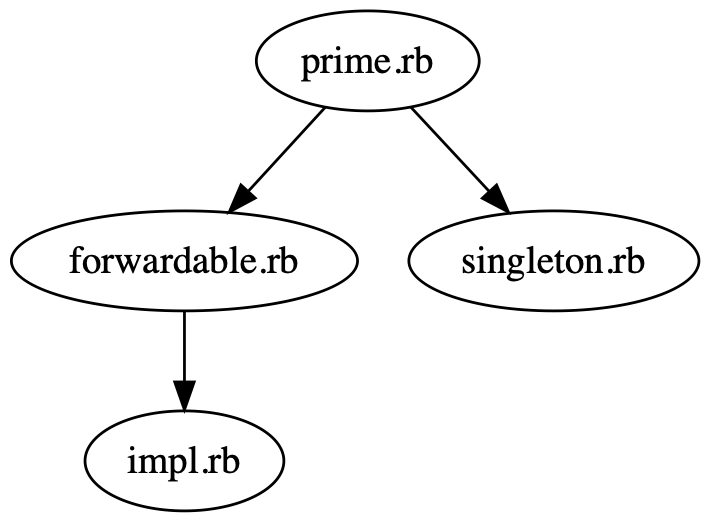

# LoadTracer

This gem can check the dependency files.

require `RUBY_VERSION` >= 2.7.0

## Installation

```
gem install load_tracer
```

### build local

clone this repository.

```
git clone https://github.com/siman-man/load_tracer.git
```

build gem.

```
bundle exec rake build
```

install gem.

```
gem install pkg/load_tracer-0.6.0.gem
```


## Usage

```ruby
require 'load_tracer'

report = LoadTracer.trace do
  require 'net/http'
end

pp report
```

### dot format

```ruby
require 'load_tracer'

puts LoadTracer.trace(format: :dot) { require 'prime' }
```

```
ruby example.rb | dot -Tpng -o example.png | open example.png
```



## License

The gem is available as open source under the terms of the [MIT License](https://opensource.org/licenses/MIT).

## Code of Conduct

Everyone interacting in the LoadTracer project’s codebases, issue trackers, chat rooms and mailing lists is expected to follow the [code of conduct](https://github.com/siman-man/load_tracer/blob/master/CODE_OF_CONDUCT.md).
